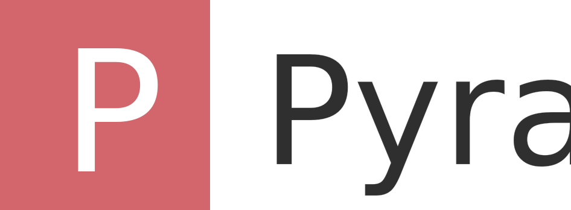

# Pyra: Distributed Ledger for the people

## No more techno-aristocracy.

Pyra is a high-level Distributed Ledger CLI, written in Rust and aiming to capable of running on top of [Substrate](www.github.com/paritytech/substrate), [Edgeware](www.github.com/hicommonwealth/edgeware-node), or [Straightege](www.github.com/heystraightedge/straightedge-node). It was developed with a focus on enabling fast experimentation. As [Keras](https://github.com/keras-team/keras) team says, _Being able to go from idea to result with the least possible delay is key to doing good research._

Use Pyra if you need a Distributed Ledger development interface that:

- Allows for easy and fast prototyping (through user friendliness, modularity, and extensibility)
- Supports both backend logic, and frontend test web ui, as well as containerized cloud infrastructure
- Runs vividly with [Web3Scan](https://github.com/polkascan/polkascan-pre-harvester) and [Telemetry](https://github.com/paritytech/substrate-telemetry)

read the documentation at [pyra.me](www.pyra.me)

## Guiding Principles

- User friendliness.
- Modularity.
- Easy scalability.
- Work with Rust.

## Installation

Before installing Pyra, install Parity Substrate.

- Substrate installation instructions

- **Install Pyra from Cargo(recommended);**
  Note: These installation steps assume that you are on a Linux or Mac environment. If you are on Windows, you will need to remove sudo to run the commands below.
  `cargo install pyra`

## Configuring your Pyra settings

By default, Pyra will use vscode as editor and Substrate as backend. [Follow these instructions]() to change them.

---

## Support

You can ask questions and join the development discussion:

- On the [Pyra google group]()
- On the [Pyra Slack channel]()