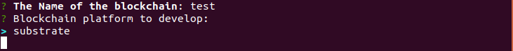
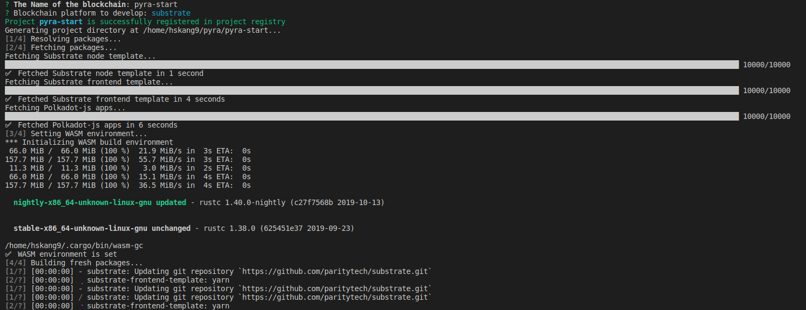
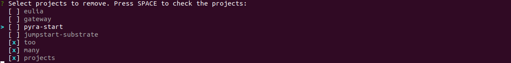
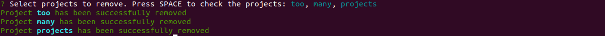

# Pyra: Distributed Ledger for the people


[](https://crates.io/crates/pyra) [](https://travis-ci.org/parachain-tracker/pyra)

### No more techno-aristocracy.

_The toolbox you need for developing the next Web3.0_

---

Pyra is a high-level Distributed Ledger CLI, written in Rust and aiming to capable of running on top of [Substrate](www.github.com/paritytech/substrate). As [Keras](https://github.com/keras-team/keras) team says, _Being able to go from idea to result with the least possible delay is key to doing good research._

Use Pyra if you need a Distributed Ledger development interface that:

- Allows for easy and fast prototyping (through user friendliness, modularity, and extensibility)
- Supports both backend logic, and frontend test web ui, as well as containerized cloud infrastructure
- Deploy testnet in local /cloud environment and battle-test with other distributed ledger platforms

## Quick links
- [Usage](#usage)
- [Stack used](#stack-used)
- [Project structure](#project-structure)
- [Roadmap](#roadmap)
- [Platform support](#platform-support)
- [FAQ](#faq)
- [Credits](#credits)

## Usage 

## Install

Cargo:
> cargo install pyra

Update:
> cargo install --force pyra

## Create a distributed ledger

Right now, pyra has only one platform substrate to start your project.
More is coming soon...

> pyra init 

You will then have to input name to register



After choosing your platform pyra will:
- Add your project in the project registry
- Create a folder with your project name
- Fetch packages needed for developing distributed ledger
- Setup WASM environment if needed
- Build packages in order to be ready to run(this might take long for some platforms.)



Navigate to the folder with 

> cd the-name-of-your-project

```
the-name-of-your-project
├── the-name-of-your-project-frontend # substrate-frontend-template
├── the-name-of-your-project-node # substrate-node-template
└── the-name-of-your-project-polkadotjs-apps # polkadot-js/apps
```

#### the-name-of-your-project-frontend

The frontend is from the [substrate-frontend-template](https://github.com/substrate-developer-hub/substrate-front-end-template).

Navigate to the folder inside the project folder with

> cd the-name-of-your-project-frontend

```
the-name-of-your-project-frontend
├── LICENSE
├── node_modules # Built with init command
├── package.json
├── public
├── README.md
├── src
└── yarn.lock
```

#### the-name-of-your-project-node

The frontend is from the [substrate-node-template](https://github.com/substrate-developer-hub/substrate-node-template).

Navigate to the folder inside the project folder with

> cd the-name-of-your-project-node

```
the-name-of-your-project-node
├── azure-pipeline.yml
├── build.rs
├── Cargo.lock
├── Cargo.toml
├── LICENSE
├── README.md
├── runtime
├── scripts
├── src
└── target # Built with init command
```

#### the-name-of-your-project-polkadotjs-apps

The frontend is from the [polkadot-js/apps](https://github.com/polkadot-js/apps).

Navigate to the folder inside the project folder with

> cd the-name-of-your-project-polkadot-js-apps

```
the-name-of-your-project-polkadotjs-apps
├── babel.config.js
├── BOUNTIES.md
├── CHANGELOG.md
├── CONTRIBUTING.md
├── deployment.extras.yml
├── deployment.template.yml
├── Dockerfile
├── gh-pages-refresh.sh
├── i18next-scanner.config.js
├── jest.config.js
├── lerna.json
├── LICENSE
├── node_modules # Built with init command
├── package.json
├── packages
├── postcss.config.js
├── README.md
├── scripts
├── test
├── tsconfig.eslint.json
├── tsconfig.json
├── types.json
└── yarn.lock
```

### Manage your project with ease

You can now open your current work with the editor on the command:

> pyra open

You can also set editor to use with each project with the command:

> pyra seteditor

If you want to remove the project, run:

> pyra remove

and you can remove multiple projects with checklist feature.



After choosing the projects, pyra removes the project.




### Build your node

After you worked on the substrate runtime, run command:

> pyra build --target runtime-or-node (default option is node)

Then pyra will ask which project to build runtime or node:


then it will `cargo build` in the project directory


### Run your node

To run your node, run command:

> pyra run 

Then pyra will ask which project to run the node binary:


After choosing the project, pyra will inform pid of the node daemon to kill when not needed.


### Interact with node

_coming soon...react-script from frontend is bugging_

To open up the frontend to interact with your running node daemon run command:

> pyra interact --ui template-or-apps

Then Pyra will ask which project to run the frontend app:


After choosing the project, pyra will `yarn start` in the fronend directory or `yarn build` then open http server to host built binary from the project directory then open webbrowser corresponding to running address(e.g. `localhost:3000`, `localhost:8000`).

### Deploy the node to local/cloud environment

_coming soon...need to determine what cloud platform to focus_

To deploy the node to local/cloud environment, run command:

> pyra deploy --env docker-or-cloud

Choosing docker will run `docker-compose` command, but cloud will have selections. After selecting platform, it will get the terraform script or kubernetes config from separate package and run it. 

### Publish your node/runtime module

_coming soon...parachaintracker on development stage_

Publish your node/runtime module with the command:

> pyra publish --target runtime-or-node

Then pyra will ask which project to publish:


After choosing the project pyra will submit project data saved in package.json which was created on initialization to hosting website.


## Stack used:
- Rust
- clap
- indicatif
- colored 
- Cargo
- yarn 
- Jest: _coming soon_
- terraform _coming soon_
- docker _coming soon_
- kubernetes _coming soon_


## Roadmap

* [x] Manage projects
    * [x] initialize project
    * [x] add existing project
    * [x] set editor to work on each project
    * [x] remove project from registry and remove files

* [ ] Map commands to operate 
    * [x] Parity Substrate
    * [ ] Cumulus
    * [ ] Edgeware(StraightEdge)
    * [ ] Subsocial
    * [ ] Kilt
    * [ ] SpeckleOS
    * [ ] Hyperledger

* [ ] Deployment infrastructure
    * [ ] Docker
    * [ ] Cloud 
        * [ ] Microsoft Azure
        * [ ] Google cloud
        * [ ] Amazon Web Service
        * [ ] Digital Ocean
 
* [ ] Package.json for project reinitialization
    * [ ] Modules(runtime)
    * [ ] Frontend
    * [ ] Apps


## Platform support
> Parity Technologies, Web3 Foundation

for more platform support, please leave an issue or contact [hskang9@gmail.com](mailto:hskang9@gmail.com)


## Questions:

### Why I created this project?

When I tried to develop something on Parity substrate runtime module I had to locate to runtime module directory, run `cargo build`, get back to project root directory, and find wasm file in `target` directory. make this in cli commands:

```bash
cd substrate-node-template
cd runtime
cargo build # and wait for 5 mins
cd ..
cd ..
cd target
cd release
... and it goes on and on...
```
There were just too many commands for me 🐨.
Also, imagine when someone has to deploy the ledger on local/cloud environment. More commands with docker were expected, and there are bunch of commands for site reliability engineer to handle. Then, when will the general public will face the distributed up and running...? Every blockchain in the field has the undelying technologies which they cannot handle; docker, kubernetes, terraform, prometheus, grafana... the list goes on and on.    
Eventually, I made the tool to do those in one command.

### Why pyra....? 

I wanted to make the name simple, I tried to go with sup(substrate-up), but there are other frameworks coming along(e.g. subsocial, kilt, etc) and substrate-up was limited to Parity substrate. Then I found pyra from pyra+mid and started to use it to call this thing.

## Credits
[Projectman](https://github.com/saurabhdaware/projectman) by Saurabh Daware. This project started from the rust [port](https://github.com/hskang9/projectman-rust) of his brilliant idea and project.   
[Polkadot-deployer](https://github.com/w3f/polkadot-deployer) by Federico Gimenez for deployment reference  
[Substrate templates](https://github.com/substrate-developer-hub) by Substrate developer hub. Pyra runs on top of the technology built by them. 
[Polkadot-js-apps](https://github.com/polkadot-js/apps) by polkadot-js team for the apps which is the dummy-proof solution to interact with the node    

## Support

The project currently is solely developed and managed by [Hyungsuk Kang]().

To contribute to this project: 
- report errors and improvement request in the issue
- Make documentation for the generalized commands to build blockchain platform dev interface
- Make commands for your blockchain platform in [platform](./platform) folder and submit it as PR
- Use this software
- Sponsor this project


Collaborations are welcome, please leave an issue [here]() or 